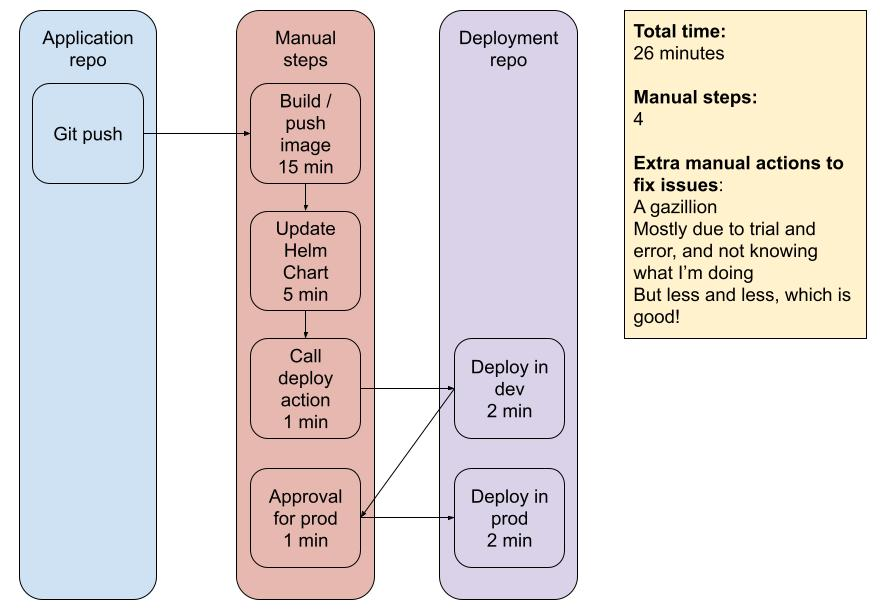

# YCIT021 - Deployment repository

## Objective

This repository is used to deploy the infrastructure and the application, all in one go

## Workflow: Deploy all the things

### Pre-flight
In that step, we are checking that the Dockerfile is properly linted.

### Deployment steps

There are two environments:
* dev
* prod

Each of these environment gets 2 steps
* {ENV}-infra:
    * It will deploy the infrastructure
    * It is based on the Moonwalkers terraform module
    * It takes the proper credentials and configs from the project secrets

* {ENV}-application
    * The application that will be deployed can be found [there](https://github.com/NicolasHostert/nuxt-realworld).
    * The image has been build and is deployed with a Helm chart that can be found [there](https://github.com/NicolasHostert/ycit021-myapp).

The dev environment will deploy immediatly when the workflow is run. The production one will wait for an approval.

Features coming next:
* Proper indication on how to reach the application once deployed

## Value Stream Mapping

